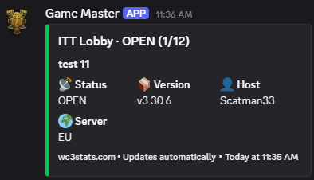
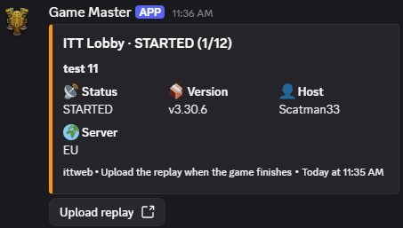
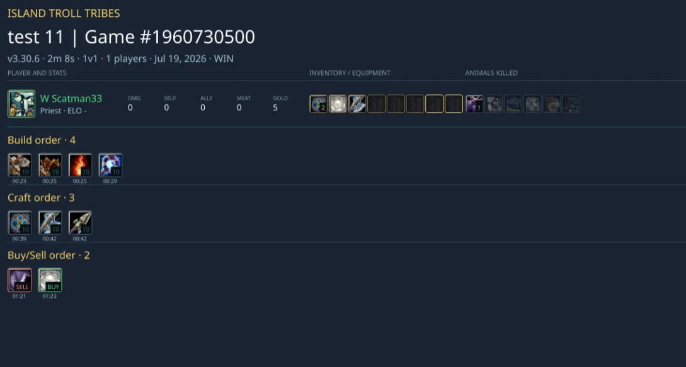

# ITT Web Discord Bot

## Features

- Schedule and manage games via `/games` command in Discord
- Monitor Warcraft III lobbies for ITT games (real-time updates)
- Post completed game statistics automatically

## Add the bot to your Discord server

If you own or administer a Discord server and want this bot there:

1. Open the invite link below and authorize.
2. Give the bot operator the channel ID where lobby/completed-game posts should appear (the ITT server uses `676097235791904820`).

You need **Manage Server** (or Administrator) permission on the target server to add a bot.

### Invite link

```text
https://discord.com/oauth2/authorize?client_id=1403760064774541445&permissions=277025770560&scope=bot%20applications.commands
```

## Screenshots

Bot message after the lobby has been created:



Bot message after the game has been started:



Bot message after the game replay has been uploaded:



## Setup (bot operators)

1. Create a Discord bot and get token/ID from [Discord Developer Portal](https://discord.com/developers/applications)
2. Create `.env` file:

```env
DISCORD_TOKEN=your_bot_token
DISCORD_CLIENT_ID=your_app_id
ITT_API_BASE=https://websites-ittweb.vercel.app
BOT_API_KEY=your_api_key
FIREBASE_SERVICE_ACCOUNT_KEY=your_firebase_json
FIREBASE_PROJECT_ID=your_project_id

# Optional: notifications (lobbies + completed games)
NOTIFICATION_CHANNEL_ID=channel_id
LOBBY_CHECK_INTERVAL=60
COMPLETED_GAMES_CHECK_INTERVAL=120
```

3. Install and run:
```bash
npm install
npm start
```

## Deployment

Deploy to Railway or similar platform. Add all environment variables from `.env` file.

## License

MIT
